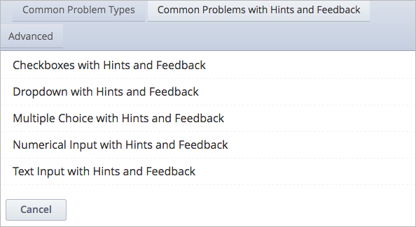

========================================
Feedback and Hints in Common Problems
========================================

You can now add feedback, hints, or both to the following problem types.

* Checkbox
* Dropdown
* Multiple Choice Problem
* Numerical Input Problem
* Text Input Problem
  
In Studio, you can use new templates to add sample problems with the feedback
and hint syntax.

When editing a unit, in the **Add New Component** panel, select **Problem**. In
the list that opens, select **Common Problems with Hints and Feedback**.

You can edit these templates to provide your own questions, feedback, and
hints.

=====================
Using Answer Feedback 
=====================

The immediacy of the feedback available to learners is a key advantage of
online instruction and difficult to do in a traditional classroom environment.

You can target feedback for common incorrect answers to the misconceptions that
are common for the level of the learner (for example, elementary, middle, high
school, college).

In addition, you can create feedback that provides some guidance to the learner
about how to arrive at the correct answer. This is especially important in text
input and numeric input problems, because without such guidance, learners might
not be able to proceed.

You can also include feedback for the correct answer to reinforce why the
answer is correct. Especially in questions where learners are able to guess,
such as multiple choice and dropdown problems, the feedback should provide a
reason why the selection is correct.

=====================
Using Hints 
=====================

To ensure that your hints can assist learners with varying backgrounds and
levels of understanding, you can provide multiple hints with different
levels of detail.

For example, the first hint can orient the learner to the problem and help
those struggling to better understand what is being asked.

The second hint can then take the learner further towards the answer.

In problems that are not graded, the third and final hint can explain the
solution for learners who are still confused.
